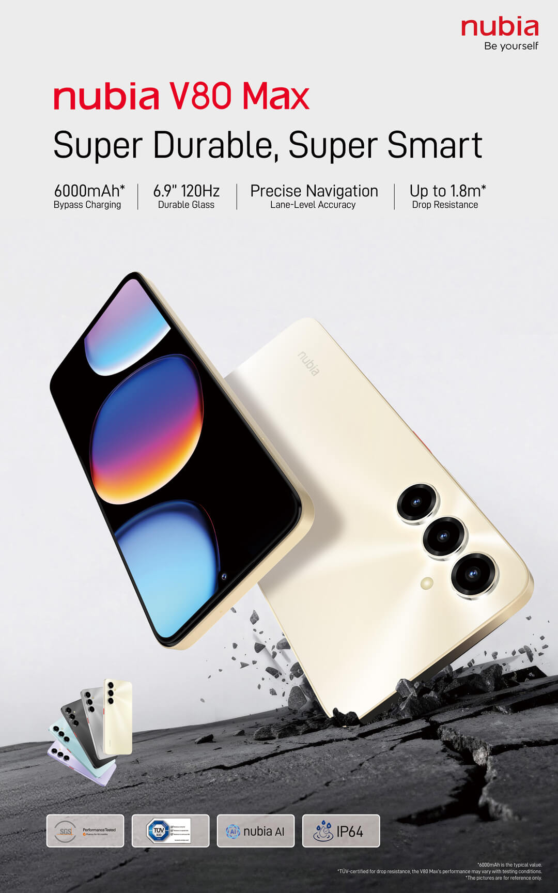

# OrangeFox Tree For Nubia V80 Max (Z2577)

| | |
|---|---|
| Device | Nubia V80 Max |
| Model | Z2577, stock name `P615F02` |
| SoC | Unisoc T7250 (UMS9230) |
| Display | 720 x 1640 |
| Android | 16, kernel 5.15 |
| Storage | 256 GB, f2fs `/data` |

## Checks

`[X]` works, `[?]` untested, `[-]` does not work

### Blocking checks

- [X] Correct screen/recovery size
- [X] Working touch, screen
- [X] Backup to internal/microSD
- [X] Restore from internal/microSD
- [X] Format data
- [X] Reboot to system
- [X] ADB
- [X] Decrypt `/data` with the PIN
- [X] Correct date
- [X] Battery level
- [X] Temperature

### Medium checks

- [X] update.zip sideload
- [X] Screen goes off and on
- [X] F2FS/EXT4, NTFS
- [X] All important partitions in the mount/backup lists
- [X] microSD format and partition
- [X] Vibrator
- [X] Touch tap haptics
- [?] exFAT
- [?] Input devices via USB-OTG, keyboard and mouse
- [-] USB mass storage export
- [-] MTP export

### Minor checks

- [X] Reboot to bootloader
- [X] Reboot to recovery
- [X] Poweroff
- [X] Fastbootd
- [X] Screenshot
- [X] Set brightness
- [X] Terminal and logcat
- [X] RNDIS
- [-] Flashlight

MTP and USB mass storage are out: this kernel has no `f_mtp` and no
`f_mass_storage` module, and no vendor module provides one. Use RNDIS
(`setprop sys.usb.rndis 1`, then `adb connect 192.168.42.129:5555`, the PC needs
192.168.42.100/24 by hand) or just `adb pull`.

## Clone

    git clone -b fox-14.1 https://github.com/XTENSEI/android_device_nubia_Z2577 device/nubia/Z2577

## Build

    orangefox_sync.sh -b 14.1
    export ALLOW_MISSING_DEPENDENCIES=true
    . build/envsetup.sh
    lunch twrp_Z2577-ap2a-eng
    mka adbd vendorbootimage

The 3-part lunch name is required. Recovery goes into `vendor_boot.img`, keep the
stock one, `fastboot boot` does not work on this SoC.

    fastboot flash vendor_boot out/target/product/Z2577/vendor_boot.img

## About

Unofficial build. `patches/` holds full source files copied over the synced tree
and the workflow greps every one of them.

## Resources

- [OrangeFox](https://gitlab.com/OrangeFox)
- [TeamWin Recovery Project](https://github.com/TeamWin)
